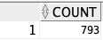
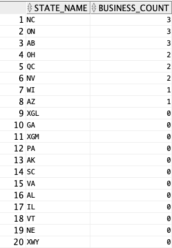
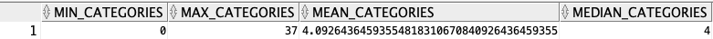
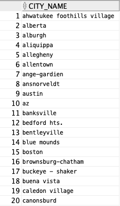
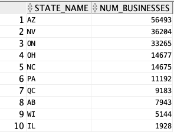
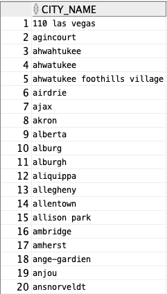
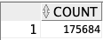

# Part 2
Deliverable 2 <br>
Assumptions <br>
<In this section write down the assumptions you made about the data, if any. Write a sentence for each assumption you made>
The DATA is somehow clean (no duplicate…)
### DDL 
<In this section write down the DDL you wrote for implementing the provided ER model>
Query Implementation
<For each query>
Query a: 
Description of logic:
<What does the query do and how do I decide to solve it>
SQL statement
<The SQL statement>
Query result (if the result is big, just a snippet)
<The SQL statement result>

QUERY E_1:

Description of logic: 

SQL statement:

QUERY E_2:

Description of logic: 

SQL statement:

~~~~ sql
SELECT B.BUSINESS_NAME, B.STARS
FROM BUSINESS B
JOIN BUSINESS_LOCATION BL ON B.BUSINESS_ID = BL.BUSINESS_ID
WHERE BL.STATE_NAME = 'CA'
ORDER BY B.STARS DESC, B.BUSINESS_NAME ASC
FETCH FIRST 10 ROWS ONLY;
~~~~

QUERY E_3:

Description of logic: 

SQL statement:

``` sql
SELECT B.business_id FROM BUSINESS B
JOIN REVIEWS R ON B.business_id = R.business_id -- Inner join?
GROUP BY B.business_id
HAVING COUNT(DISTINCT R.user_id) > 1030
ORDER BY B.business_id ASC;
```

QUERY E_4:

Description of logic: 

SQL statement:
``` sql
SELECT B.business_id, B.business_name, B.review_count FROM BUSINESS B
JOIN business_dietary_restrictions D ON B.business_id = D.business_id
WHERE 
    B.review_count > 3000
GROUP BY B.business_id, B.business_name, B.review_count
HAVING COUNT(D.dietary_rest_id) > 2
ORDER BY B.review_count DESC;
```
QUERY E_5:

Description of logic: 

SQL statement:

QUERY E_6:

Description of logic: 
We first need to count, for each user, the number of businesses they reviewed. Then we simply compute the max of these counts. 
More precisely, we have an sub query on the table REVIEWS that counts for each user, the number of distinct businesses they reviewed. Then we simply select the maximum of these counts. 

SQL statement:
``` sql
SELECT max(rv_ct_usr) as count
From (
    SELECT user_id, count( distinct BUsiness_id) as rv_ct_usr
    From REVIEWS
    GROUP BY user_id
);
```

Result:



QUERY E_7:

Description of logic: 
We first find the DIETARY_REST_ID corresponding to. ‘vegetarian’, then we find all the businesses with this DIETARY_REST_ID, we count, by states, these businesses and adding the states which do not have such restaurant (setting the count to 0).
In details : 
A sub query simply select from BUSINESS_DIETARY_RESTRICTION the DIETARY_REST_ID of the tuple having DIETARY_REST_DESCRIPTION ‘vegetarian’
Another subquery on BUSINESS selects only the BUSINESS_ID of tuples having the found DIETARY_REST_ID
Then we perform a join of these BUSINESS_ID with BUSINESS_LOCATION (ON BUSINESS_ID) so that we have the location of all BUSINESS VEGETARIAN
Then we count the distinct BUSINESS_ID by state
We finally join with all states in STATES (on STATE_NAME) so that states that do not have BUSINESS with ‘vegetarian’ tag still appear with count 0


SQL statement:
``` sql
SELECT STATES.state_name as state_name, COALESCE(cts.ct, 0) as business_count
FROM STATES
LEFT JOIN 
    (SELECT BUSINESS_LOCATION.STATE_NAME, COUNT(*) as ct
    FROM BUSINESS_LOCATION
    JOIN (SELECT DISTINCT BUSINESS_ID 
        FROM business_dietary_restrictions
        WHERE business_dietary_restrictions.DIETARY_REST_ID =(
            SELECT DIETARY_REST_ID
            FROM dietary_restrictions 
            WHERE dietary_restrictions.dietary_rest_description = 'vegetarian'
            )
        ) VBs 
    on BUSINESS_LOCATION.BUSINESS_ID = VBs.BUSINESS_ID
    GROUP BY BUSINESS_LOCATION.STATE_NAME) cts
on STATES.state_name = cts.STATE_NAME
ORDER BY business_count DESC ;
```
Result:




QUERY E_8:

Description of logic: 
We first count by BUSINESS_ID in BUSINESS_HAS_CATEGORIES. Then we join with all BUSINESS (on BUSINESS_ID) so that businesses with no category still appear and with count 0. Then we simply apply the min, max, avg, and median functions. 

SQL statement:
```sql
SELECT min(ct) as min_categories, max(ct) as max_categories, 
AVG(ct) as mean_categories, MEDIAN(ct) as median_categories
FROM 
    (SELECT COALESCE(BCs_ct.ct, 0) as ct
    FROM (BUSINESS
    LEFT JOIN
        (SELECT BUSINESS_ID, COUNT(*) as ct
        FROM business_has_categories
        GROUP BY business_id) BCs_ct
        on business.business_id = BCs_ct.business_id)
        ) ;
```

Result:



QUERY E_9:

Description of logic: 

SQL statement:
```sql
SELECT MAX(category_count) AS "count"
FROM (
    SELECT BUSINESS_ID, COUNT(*) AS category_count
    FROM BUSINESS_HAS_CATEGORIES
    GROUP BY BUSINESS_ID
);
```
QUERY E_10:

Description of logic: 

SQL statement:


General Comments
<In this section write general comments about your deliverable (comments and work allocation between team members>

QUERY D_1:

Description of logic: 
Fisrt we find the business that work more or exactly 5 days a week. Then we find the cities which contain at least one business that work more or exactly 5 days a week. In the end we select all the cities but the one which appeared in the previous table.
In detail : 
- We create a table BM5 wich is the selection of buisness_id in buisness_hours which have count of distince day_id superirior or equal to five i.e businezses working more or exactly five days
- Then we  create a table ct5 which is a right join BUSINESS_LOCATION-BM5 on buisness_id, this allows us to link the businesses working more than or exaclty 5 days a week with their city. Using a right join allows to only select the city_name having a business in BM5. We then select the distinct_name of this join. 
- In the end we perform a left join CITIES-ct5 on city_name to link eith all the city names, filtering out the ones that are in ct5 by selecting only the rows with NULL in the join. 


SQL statement:
```sql
WITH BM5 AS (SELECT distinct Business_id
    FROM BUSINESS_HOURS
    GROUP BY Business_id
    HAVING COUNT(DISTINCT DAY_ID) >= 5
    ),--Businesses working more than or exaclty 5 days a week
CT5 AS (SELECT distinct BL.city_name
    FROM BUSINESS_LOCATION BL
    RIGHT JOIN BM5
on bl.business_id = BM5.business_id) -- cities with businesses working more than or exaclty 5 days a week 
SELECT cti.city_name 
FROM CITIES cti
LEFT JOIN CT5
on cti.city_name = ct5.city_name
WHERE ct5.city_name IS NULL;
```

Results :




QUERY D_2:

Description of logic: 
We count each occurence of each state_name in the business_location table, then use the RANK() and ORDER function to retrieve the 10 most occuring state_name.

SQL statement:
```sql
SELECT STATE_NAME as state_name, n_b as num_businesses
FROM (
  SELECT STATE_NAME, COUNT(*) AS n_b,
         RANK() OVER (ORDER BY COUNT(*) DESC) AS rank_num
  FROM BUSINESS_LOCATION
  GROUP BY STATE_NAME
) 
WHERE rank_num <= 10;
```

Results :




QUERY D_3:

Description of logic: 

SQL statement:

```sql
SELECT B.BUSINESS_NAME, B.STARS, B.REVIEW_COUNT -- , BC.CATEGORY_NAME, M.MUSIC_DESCRIPTION
FROM BUSINESS B
JOIN BUSINESS_HAS_CATEGORIES BHC ON B.BUSINESS_ID = BHC.BUSINESS_ID
JOIN BUSINESS_CATEGORIES BC ON BHC.CATEGORY_ID = BC.CATEGORY_ID
JOIN BUSINESS_MUSIC BM ON B.BUSINESS_ID = BM.BUSINESS_ID
JOIN MUSIC M ON BM.MUSIC_ID = M.MUSIC_ID
WHERE BC.CATEGORY_NAME = 'Irish Pub'
AND M.MUSIC_DESCRIPTION = 'live'
ORDER BY B.BUSINESS_NAME ASC;
```

QUERY D_4:

Description of logic: 
We first find businesses with less than 2 reviews. Then we select cities which have at least one of these businesses. In the end we link all the cities so that cities with no business do apear adn filter out cities that were slected in the previous sentence.
In details:
- A subquery select the Business_id when review_count < 2 in BUSINESS_LOCATION
- A subquery select tuples in Buisness_location if the buisness_id is in the previous query result
- A final query select all city_name that are not in the previous subquery.

SQL statement:
```sql
SELECT distinct CT.city_name as city_name
FROM CITIES CT
WHERE CT.city_name NOT IN ( 
    SELECT distinct BL.city_name
    FROM BUSINESS_LOCATION BL
    WHERE EXISTS (SELECT Business_id 
    FROM Business Bs
    WHERE bs.business_id = bl.business_id and bs.review_count < 2  
    ) --cities with businesses having less then two reviews
) ORDER BY city_name 
FETCH FIRST 50 ROWS ONLY;
```

Result:



QUERY D_5:

Description of logic: 

SQL statement:
```sql
SELECT AVG(B.STARS) AS stars, SUM(B.REVIEW_COUNT) AS review_count
FROM BUSINESS B
WHERE B.BUSINESS_ID IN (
    SELECT BHC.BUSINESS_ID
    FROM BUSINESS_HAS_CATEGORIES BHC
    GROUP BY BHC.BUSINESS_ID
    HAVING COUNT(*) >= 2
)
AND B.BUSINESS_ID IN (
    SELECT BPT.BUSINESS_ID
    FROM BUSINESS_PARKING_TYPE BPT
    GROUP BY BPT.BUSINESS_ID
    HAVING COUNT(*) > 1
);
```

QUERY D_6:

Description of logic: 
First we store all the positive_tips, the we select all user thast fulfill the "yestersay condition". Then for each business_id, we check if there is a user who left a tip and who is not the user fulfilling the condition.
In details :
- We select the USER_ID, BUSINESS_ID, and TIP_DATE from the TIPS table where the TIP_TEXT contains the word "awesome" (= the positive tips) adn store in the table positive_tips
- WE select distinct USER_IDs from the positive_tips CTE where there exists another tip by the same user with a TIP_DATE one day earlier
- In the main query, we select the count of distinct BUSINESS_IDs from BUSINESS using a WHERE clause including a subquery that checks for the existence of a USER_ID that is not in users fulfilling the conditions and who gave a positive tip to this business.

SQL statement:
```sql
WITH positive_tips AS (
    SELECT USER_ID, BUSINESS_ID, TIP_DATE
    FROM TIPS
    WHERE LOWER(TIP_TEXT) LIKE '%awesome%'),
user_yesterday AS (
    SELECT DISTINCT pt1.USER_ID
    FROM positive_tips pt1
    JOIN positive_tips pt2 ON pt1.USER_ID = pt2.USER_ID AND TO_DATE(pt1.TIP_DATE, 'DD-MON-RR') - 1 = TO_DATE(pt2.TIP_DATE, 'DD-MON-RR')
)
SELECT count(distinct Business_ID) as count 
FROM BUSINESS bs
WHERE NOT EXISTS (
    SELECT pt.USER_ID
    FROM positive_tips pt
    WHERE bs.BUSINESS_ID = pt.business_id
    AND pt.USER_ID NOT IN (SELECT USER_ID FROM user_yesterday)
);
```

Results: 



QUERY D_7:

Description of logic: 

SQL statement:
```sql
SELECT
  (
    SELECT AVG(B.STARS)
    FROM BUSINESS B
    JOIN BUSINESS_GOOD_FOR_MEAL BGFM ON B.BUSINESS_ID = BGFM.BUSINESS_ID
    JOIN GOOD_FOR_MEAL GFM ON BGFM.GOOD_FOR_MEAL_ID = GFM.GOOD_FOR_MEAL_ID
    JOIN BUSINESS_AMBIANCE BA ON B.BUSINESS_ID = BA.BUSINESS_ID
    JOIN AMBIANCE A ON BA.AMBIANCE_ID = A.AMBIANCE_ID
    WHERE GFM.GOOD_FOR_MEAL_DESCRIPTION = 'dinner'
    AND A.AMBIANCE_DESCRIPTION = 'divey'
  ) - 
  (
    SELECT AVG(B.STARS)
    FROM BUSINESS B
    JOIN BUSINESS_GOOD_FOR_MEAL BGFM ON B.BUSINESS_ID = BGFM.BUSINESS_ID
    JOIN GOOD_FOR_MEAL GFM ON BGFM.GOOD_FOR_MEAL_ID = GFM.GOOD_FOR_MEAL_ID
    JOIN BUSINESS_AMBIANCE BA ON B.BUSINESS_ID = BA.BUSINESS_ID
    JOIN AMBIANCE A ON BA.AMBIANCE_ID = A.AMBIANCE_ID
    WHERE GFM.GOOD_FOR_MEAL_DESCRIPTION = 'dinner'
    AND A.AMBIANCE_DESCRIPTION = 'upscale'
  ) AS DIFFERENCE_OF_AVERAGES
FROM DUAL;
```
QUERY D_8:

Description of logic: 

SQL statement:
```sql

```
QUERY D_9:

Description of logic: 

SQL statement:
```sql

```

QUERY D_10:

Description of logic: 

SQL statement:
```sql

```


Optimization with indexing :

QUERY D4 :


